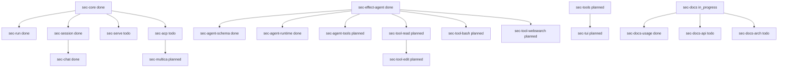

# SEC Project

Effect-native AI CLI using Effect Agent framework. Synced from `slate-effect-cli/.sec-tasks/`.

## Quick Links

- [[sec-core|SEC Core]]
- [[sec-run|sec run]]
- [[sec-chat|sec chat]]
- [[sec-session|sec session]]
- [[sec-serve|sec serve]]
- [[sec-acp|sec acp]]
- [[sec-effect-agent|effect-agent Refactor]]
- [[sec-tools|Tool System]]
- [[sec-tui|TUI Interface]]

## Task Board

### ✅ Done

- [x] **sec-run** - 单次 AI 调用
- [x] **sec-chat** - REPL 会话
- [x] **sec-session** - Session 持久化
- [x] **sec-effect-agent** - effect-agent 重构
- [x] **sec-agent-schema** - Schema 定义
- [x] **sec-agent-runtime** - Runtime 集成
- [x] **sec-docs-usage** - 使用文档

### 🔄 In Progress

- [ ] **sec-docs** - 文档 (in progress)

### ⏳ Todo

- [ ] **sec-serve** - HTTP server
- [ ] **sec-acp** - ACP 协议
- [ ] **sec-docs-api** - API 文档
- [ ] **sec-docs-arch** - 架构文档

### 📋 Planned

- [ ] **sec-tools** - 工具调用系统
- [ ] **sec-tool-read** - read 工具
- [ ] **sec-tool-bash** - bash 工具
- [ ] **sec-tool-edit** - edit 工具
- [ ] **sec-tool-websearch** - websearch 工具
- [ ] **sec-agent-tools** - Toolkit 组合
- [ ] **sec-tui** - TUI 界面
- [ ] **sec-multica** - multica 集成

## DAG Graph



## Key Achievements

> 2024-09-04: 用 effect-agent 模式重写 sec 成功
> 关键修正: apiKey: Redacted.make("ak-local-cpa"), baseUrl: "http://127.0.0.1:8317"
> 测试: "1+1等于多少" → "1+1等于2。"

## Architecture Notes

### effect-agent Runtime Model

```typescript
// 1. Schema-first
class UserMessage extends Schema.Class<UserMessage>("UserMessage")({
  content: Schema.String,
}) {}

// 2. Tool definition
const ReadTool = Tool.make("read", {
  description: "Read file contents",
  parameters: ReadParams,
  success: ReadSuccess,
  failure: ReadError,
  failureMode: "error",
});

// 3. Toolkit composition
const SecToolkit = Toolkit.make(ReadTool, BashTool);

// 4. Agent definition
const SecAgent = Agent.make("sec", {
  input: UserMessage,
  output: AiResponse,
  instructions: ({ content }) => Effect.succeed(`You are sec. ${content}`),
  toolkit: SecToolkit,
  policy: AgentPolicy.make({
    maxTurns: 5,
    maxToolCalls: 10,
    maxDuration: "60 seconds",
    toolConcurrency: 3,
  }),
});

// 5. Run
AgentRuntime.run(SecAgent, input).pipe(
  Effect.provide(OpenAiLanguageModel.model("openrouter/openrouter/free")),
  Effect.provide(OpenAiClient.layer({
    apiKey: Redacted.make("ak-local-cpa"),
    apiUrl: "http://127.0.0.1:8317",
  })),
  Effect.provide(ThreadHistory.layerTransient),
  Effect.provide(IdGenerator.layer),
  Effect.provide(FetchHttpClient.layer),
)
```

## Sync Status

✅ Multiple locations:
- `slate-effect-cli/.sec-tasks/tasks-dag.json` (JSON)
- `slate-effect-cli/.sec-tasks/tasks.md` (Markdown)
- `slate-effect-cli/.sec-tasks/tasks.org` (Org-mode)
- `slate-effect-cli/.sec-tasks/tasks.edn` (EDN)
- `slate-effect-cli/.sec-tasks/logseq-tasks.md` (Logseq)
- `slate-effect-cli/.sec-tasks/obsidian-tasks.md` (Obsidian)
- `slate-effect-cli/.sec-tasks/tasks.datascript.edn` (Datascript/DB)
